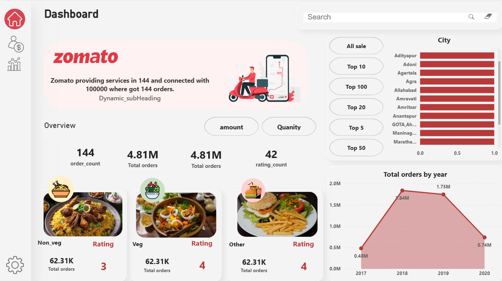

# Zomato Analytics Dashboard

Interactive Power BI dashboard analyzing Zomato orders, ratings, and city performance.

## Tools Used

- Power BI
- Excel
- Data Visualization

## Dashboard Features

- Order count analysis
- Ratings analysis
- City performance comparison
- Yearly order trends
- Category analysis (Veg / Non-Veg / Other)

## Project Goal

The goal of this dashboard is to analyze food delivery performance and identify trends in orders, ratings, and customer preferences across cities.
